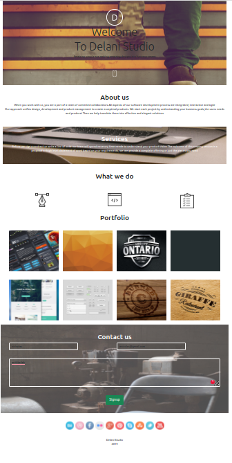

# Delani Studio

- Delani studio is a web site that people who want web applications and mobile applications go to for their services

---
# preview



---
**Version1.0.0**

---

---
## Authors
- Nicholas Barkote <nicholas.kebut@student.moringaschool.com>
---

## Requirements

- google Chrome
- git

## Setup Instructions

* clone it to your desktop 
```bash
 git clone  https://github.com/barkotenicholas/Delani-Studio.git
 cd Delani-Studio
 code .
  ```
* Open index.html with a google chrome or a browser of your choice
 
# Tech Stack

- HTML
- CSS
- js
- Jquery
- BootStrap

## Contact Information

<a href="mailto:barkotenicholas@gmail.com">barkotenicholas@gmail.com</a>

 ## Live Link


[Click here to see the website](https://barkotenicholas.github.io/Delani-Studio/)


## License & copyright

© Nicholas k Barkote , Moringa school student

Licensed under the [MIT License](LICENSE)